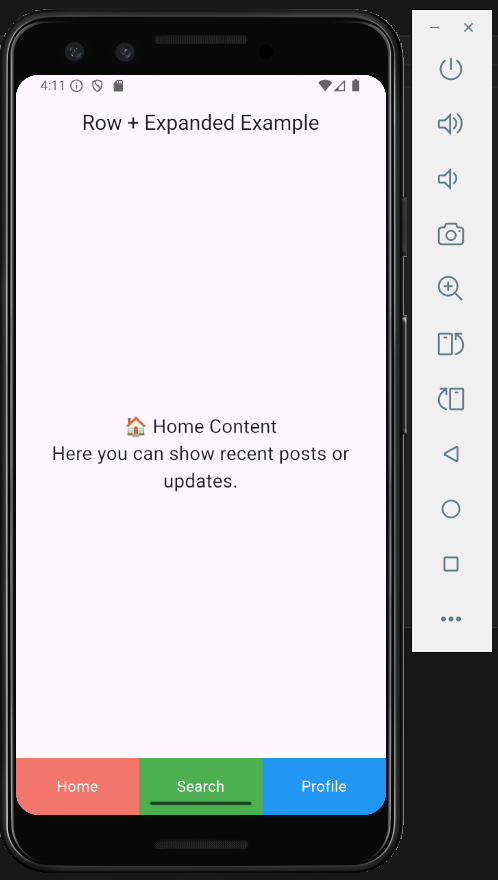

# Row + Expanded Flutter Demo

A simple Flutter demo showcasing the use of the **Row** and **Expanded** widgets to create a bottom navigation bar with three tabs (`Home`, `Search`, `Profile`) and dynamic content updates.

---

## Widget Description

**Widgets:** `Row` + `Expanded`  
Thiss highlights how `Expanded` works inside a `Row` to evenly distribute space for navigation tabs in a bottom navigation bar.

---

## Three Attributes Demonstrated

1. **Row.children** – Defines the horizontal layout of the navigation items.  
2. **Expanded.child** – Makes each tab expand equally to fill available horizontal space.  
3. **Container.color** – Changes the background color of the tab; opacity is used to highlight the active tab.

During the live demo, these attributes can be shown affecting the layout and visual appearance of the tabs.

---

## Screenshot of the UI Embedded



## How to Run

1. Make sure you have Flutter installed: [Flutter Install]
2. Clone the repository or copy the project code.  
3. Open the project folder in a terminal.  
4. Run the app using:

```bash

git clone https://github.com/EliseJulio/FlutterWidget.git
cd FlutterWidget
cd lib
flutter run
